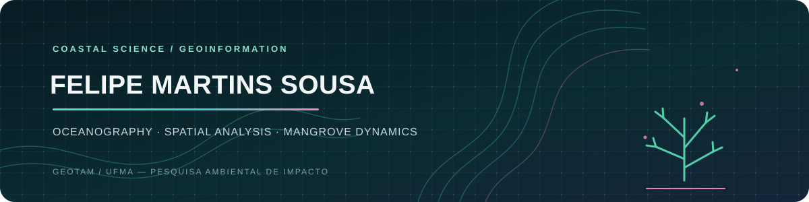

<p align="center">
  
</p>

<p align="center">
  
</p>

<p align="center">
  <a href="https://pepocean.notion.site/Portf-lio-255850421957804dad00ce629ca951a6"></a>
  <a href="https://github.com/oceanpep/br-mangue-studio"></a>
  <a href="https://www.linkedin.com/in/felipe-martins-sousa-9291b8302"></a>
  <a href="https://orcid.org/0009-0009-0505-4845"></a>
</p>

<p align="center"><samp>FOCO: SISTEMAS COSTEIROS · GEOINFORMAÇÃO · CIÊNCIA ABERTA</samp></p>

---

### // SOBRE MIM

Sou tecnólogo em **Análise e Desenvolvimento de Sistemas**, com especialização em **Análise de Dados**. Atualmente, sou mestrando em **Ciência e Tecnologia Ambiental** e graduando em **Oceanografia** na Universidade Federal do Maranhão (UFMA).

Meu trabalho conecta análise de dados ambientais, sensoriamento remoto, geoprocessamento e modelagem espacial.

```json
{
  "projeto_atual": "BR-MANGUE Studio",
  "foco_de_pesquisa": ["manguezais", "sistemas costeiros", "modelagem espacial"],
  "abordagem": "geotecnologias e software científico reprodutível"
}
```

### // PROJETO EM DESTAQUE

#### [BR-MANGUE Studio](https://github.com/oceanpep/br-mangue-studio)

Aplicação desktop em Python para simular e explorar a dinâmica espacial dos manguezais. Integra dados raster, cenários ambientais, mapas, trajetórias anuais e resultados reprodutíveis.

**Desenvolvido no contexto de pesquisa do GEOTAM/UFMA.**

[](https://github.com/oceanpep/br-mangue-studio)
[](https://oceanpep.github.io/br-mangue-studio/)

### // PESQUISA, LABORATÓRIOS E GRUPOS

- **GEOTAM/UFMA** — laboratório principal ligado ao desenvolvimento do BR-MANGUE Studio.
- **MOceanS/INPE** e **LAMA/UFMA** — participação em pesquisa e colaboração laboratorial.
- Grupos de pesquisa: [LambdaGeo](https://dgp.cnpq.br/dgp/espelhogrupo/771872) e [CEGMANGUE](https://dgp.cnpq.br/dgp/espelhogrupo/776502).

### // ARSENAL DE GEOTECNOLOGIAS

<p align="center">
  
  
  
  
  
  
</p>

| Linguagem | Aplicações |
|---|---|
| **Python** | Aprendizado de máquina, sensoriamento remoto, autômatos celulares e desenvolvimento de frameworks |
| **R** | Bioestatística, análise multivariada, geoprocessamento e dados LiDAR |
| **JavaScript** | Google Earth Engine, análise climática, uso e cobertura da terra e séries temporais |
| **Lua** | Modelagem espacialmente explícita e simulação de sistemas dinâmicos discretos |

### // PRODUÇÃO E ENSINO

- Coautor do capítulo [*Estimation of the Vulnerability of the Coastal Zone of the Amazon to Sea-Level Rise Due to Climate Change*](https://doi.org/10.1007/978-3-031-81465-5_11) (Springer, 2025).
- Minicurso **Geopython com Google Earth Engine: análises ambientais na nuvem**, na XI Semana Acadêmica de Oceanologia da FURG (2025).

### // CONECTE-SE

<p align="center">
  <a href="https://pepocean.notion.site/Portf-lio-255850421957804dad00ce629ca951a6">Portfólio</a> ·
  <a href="https://www.linkedin.com/in/felipe-martins-sousa-9291b8302">LinkedIn</a> ·
  <a href="https://orcid.org/0009-0009-0505-4845">ORCID</a> ·
  <a href="https://lattes.cnpq.br/1933589345525424">Currículo Lattes</a> ·
  <a href="https://oceanpep.github.io/br-mangue-studio/">BR-MANGUE Studio</a>
</p>

<details>
<summary><strong>English version</strong></summary>

I hold a technologist degree in Systems Analysis and Development, with a specialization in Data Analysis. I am currently an MSc student in Environmental Science and Technology and an undergraduate Oceanography student at the Federal University of Maranhão (UFMA).

My work connects environmental data analysis, remote sensing, geoprocessing, and spatial modelling.

### Featured project

[**BR-MANGUE Studio**](https://github.com/oceanpep/br-mangue-studio) is a Python desktop application for simulating and exploring mangrove spatial dynamics. It combines raster data, environmental scenarios, maps, annual trajectories, and reproducible outputs. The project is developed in the research environment of **GEOTAM/UFMA**.

### Research and affiliations

Member of **GEOTAM/UFMA**, **MOceanS/INPE**, and **LAMA/UFMA**; researcher with [LambdaGeo](https://dgp.cnpq.br/dgp/espelhogrupo/771872) and [CEGMANGUE](https://dgp.cnpq.br/dgp/espelhogrupo/776502).

### Technical focus

Python (machine learning, remote sensing, cellular automata) · R (biostatistics, multivariate analysis, geoprocessing, LiDAR) · JavaScript (Google Earth Engine, climate and land-cover time series) · Lua (spatially explicit and discrete dynamic-system modelling).

### Selected research and teaching

- Co-author of the 2025 Springer chapter [*Estimation of the Vulnerability of the Coastal Zone of the Amazon to Sea-Level Rise Due to Climate Change*](https://doi.org/10.1007/978-3-031-81465-5_11).
- Instructor of a GeoPython and Google Earth Engine short course on cloud-based environmental analysis at FURG's 2025 Oceanography Academic Week.

[Portfolio](https://pepocean.notion.site/Portf-lio-255850421957804dad00ce629ca951a6) · [LinkedIn](https://www.linkedin.com/in/felipe-martins-sousa-9291b8302) · [ORCID](https://orcid.org/0009-0009-0505-4845) · [Lattes CV](https://lattes.cnpq.br/1933589345525424)

</details>