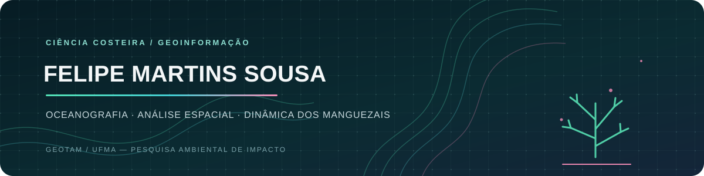
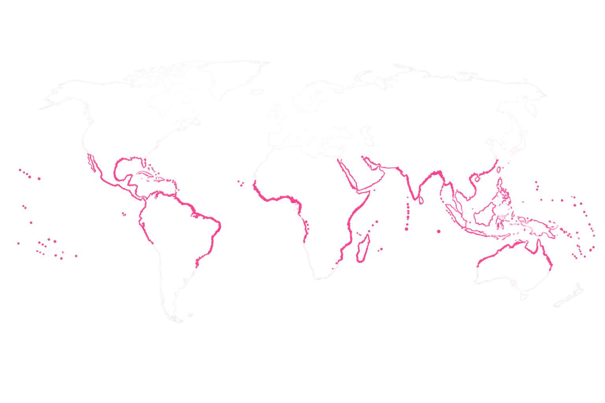
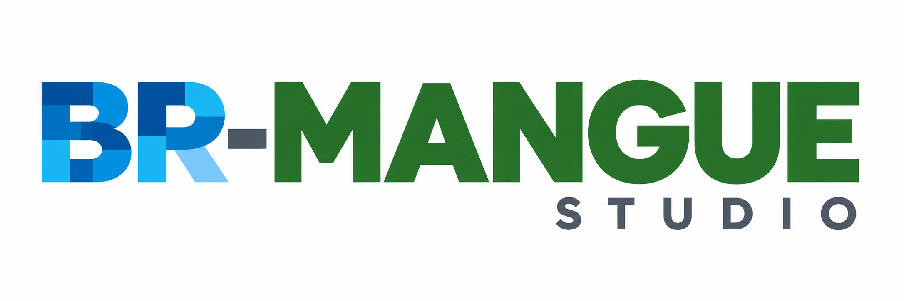
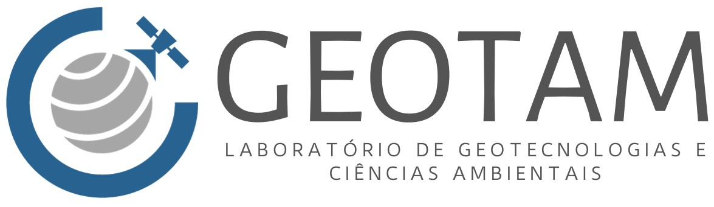
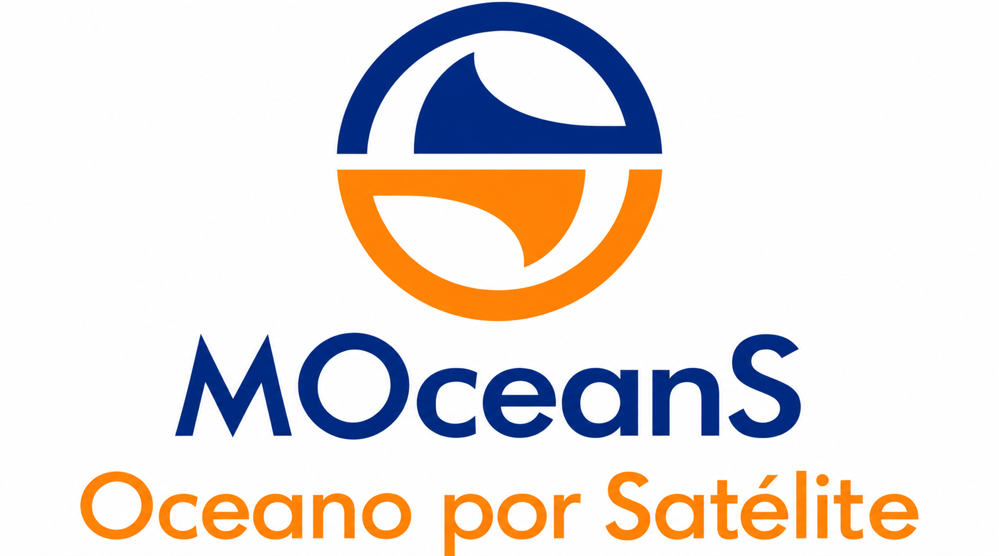
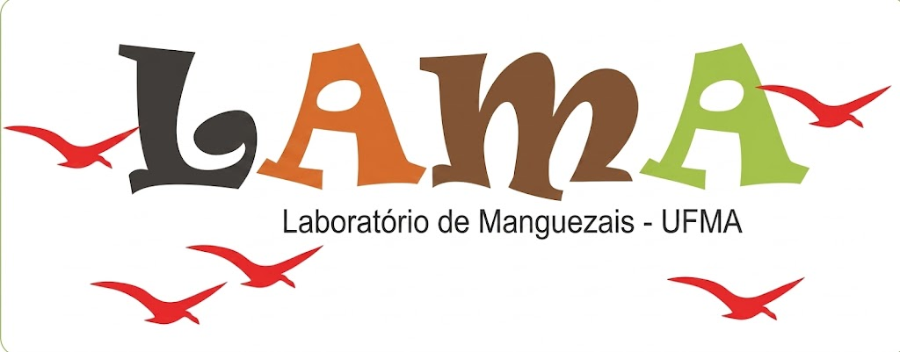

<p align="center">
  <a href="README.md">🇬🇧 English</a> · <a href="README.pt-BR.md">🇧🇷 Português (Brasil)</a>
</p>

<p align="center">
  
</p>

<p align="center">
  
</p>

<p align="center">
  <a href="https://pepocean.notion.site/Portf-lio-255850421957804dad00ce629ca951a6"></a>
  <a href="https://github.com/oceanpep/br-mangue-studio"></a>
  <a href="https://www.linkedin.com/in/felipe-martins-sousa-9291b8302"></a>
  <a href="https://orcid.org/0009-0009-0505-4845"></a>
</p>

<p align="center"><samp>FOCO: SISTEMAS COSTEIROS · GEOINFORMAÇÃO · CIÊNCIA ABERTA</samp></p>

---

### // SOBRE MIM

Sou tecnólogo em **Análise e Desenvolvimento de Sistemas**, com especialização em **Análise de Dados**. Atualmente, sou mestrando em **Ciência e Tecnologia Ambiental** e graduando em **Oceanografia** na Universidade Federal do Maranhão (UFMA).

Meu trabalho conecta análise de dados ambientais, sensoriamento remoto, geoprocessamento e modelagem espacial.
<p align="center">
  
</p>
<p align="center"><sub>Distribuição global dos manguezais · Um panorama visual dos ecossistemas costeiros que estão no centro da minha pesquisa</sub></p>

```json
{
  "projeto_atual": "BR-MANGUE Studio",
  "foco_de_pesquisa": ["manguezais", "sistemas costeiros", "modelagem espacial"],
  "abordagem": "geotecnologias e software científico reprodutível"
}
```

### // PROJETO EM DESTAQUE

#### [BR-MANGUE Studio](https://github.com/oceanpep/br-mangue-studio)
<p align="center">
  <a href="https://github.com/oceanpep/br-mangue-studio"></a>
</p>

Aplicativo desktop em Python para simular e explorar a dinâmica espacial dos manguezais. Integra dados raster e cenários ambientais para gerar mapas, trajetórias anuais e resultados reprodutíveis.

**Desenvolvido no contexto de pesquisa do GEOTAM/UFMA.**

[](https://github.com/oceanpep/br-mangue-studio)
[](https://oceanpep.github.io/br-mangue-studio/)

### // PESQUISA, LABORATÓRIOS E GRUPOS

<table align="center">
  <tr>
    <td align="center" valign="middle"><strong>Laboratório de desenvolvimento</strong><br /><sub>GEOTAM / UFMA · Laboratório principal</sub><br /><br /></td>
    <td align="center" valign="middle"><strong>Laboratório parceiro</strong><br /><sub>MOceanS / INPE</sub><br /><br /></td>
    <td align="center" valign="middle"><strong>Laboratório parceiro</strong><br /><sub>LAMA / UFMA</sub><br /><br /></td>
  </tr>
</table>

<p align="center"><sub>O GEOTAM é o laboratório principal associado ao desenvolvimento do BR-MANGUE Studio. MOceanS e LAMA são parceiros de pesquisa.</sub></p>
<p align="center">Grupos de pesquisa: <a href="https://dgp.cnpq.br/dgp/espelhogrupo/771872">LambdaGeo</a> · <a href="https://dgp.cnpq.br/dgp/espelhogrupo/776502">CEGMANGUE</a></p>

### // FERRAMENTAS GEOESPACIAIS

<p align="center">
  
  
  
  
  
  
</p>

| Linguagem | Aplicações |
|---|---|
| **Python** | Aprendizado de máquina, sensoriamento remoto, autômatos celulares e desenvolvimento de frameworks |
| **R** | Bioestatística, análise multivariada, geoprocessamento e dados LiDAR |
| **JavaScript** | Google Earth Engine, análise climática, mapeamento de cobertura da terra e séries temporais |
| **Lua** | Modelagem espacialmente explícita e simulação de sistemas dinâmicos discretos |

### // PESQUISA E ENSINO EM DESTAQUE

- Coautor do capítulo da Springer (2025) [*Estimation of the Vulnerability of the Coastal Zone of the Amazon to Sea-Level Rise Due to Climate Change*](https://doi.org/10.1007/978-3-031-81465-5_11).
- Ministrante do minicurso **Geopython com Google Earth Engine: análises ambientais na nuvem**, na Semana Acadêmica de Oceanologia da FURG (2025).

### // CONTATO

<p align="center">
  <a href="https://pepocean.notion.site/Portf-lio-255850421957804dad00ce629ca951a6">Portfólio</a> ·
  <a href="https://www.linkedin.com/in/felipe-martins-sousa-9291b8302">LinkedIn</a> ·
  <a href="https://orcid.org/0009-0009-0505-4845">ORCID</a> ·
  <a href="https://lattes.cnpq.br/1933589345525424">Currículo Lattes</a> ·
  <a href="https://oceanpep.github.io/br-mangue-studio/">BR-MANGUE Studio</a>
</p>